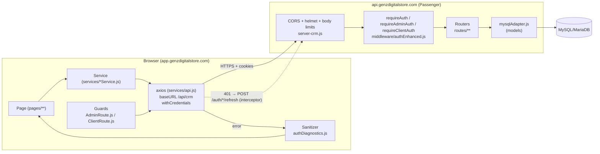
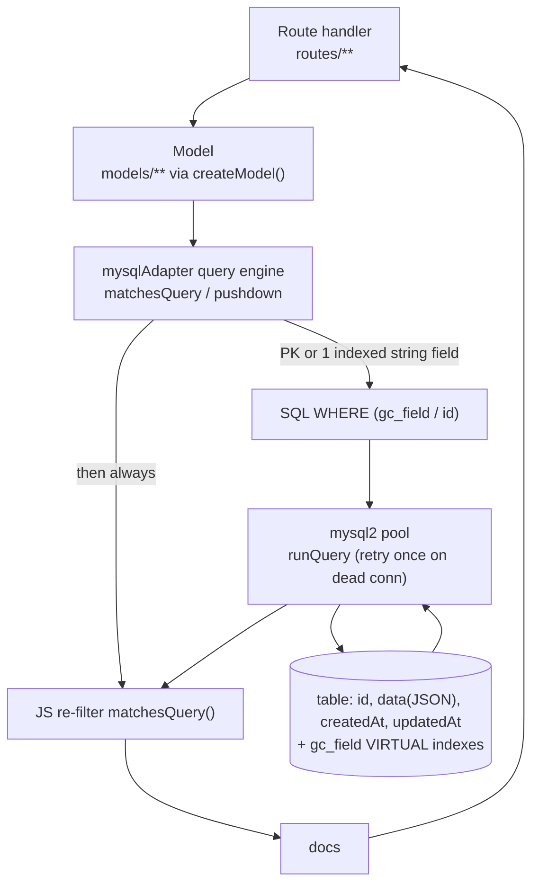
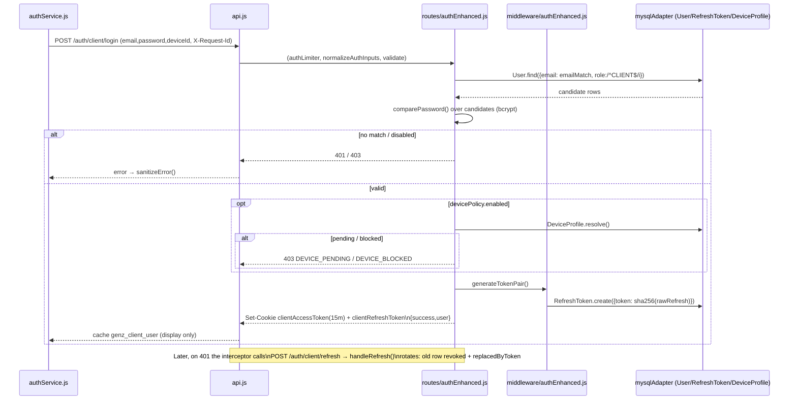
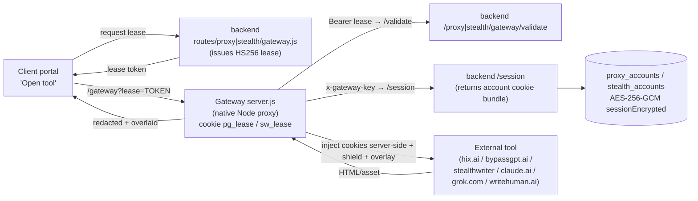
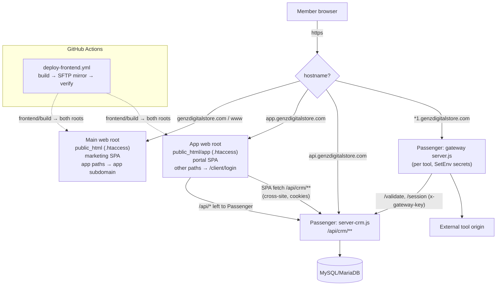

# System Diagrams (As-Built)

> Mermaid diagrams built only from verified code paths. Node labels reference real files.

---

## 1. Frontend → Backend flow

## 2. Backend → Database flow

## 3. Authentication flow (client shown; admin identical with admin* cookies)

## 4. Gateway & external-service flow (per tool)

## 5. Production request flow (hosts, roots, proxies)

