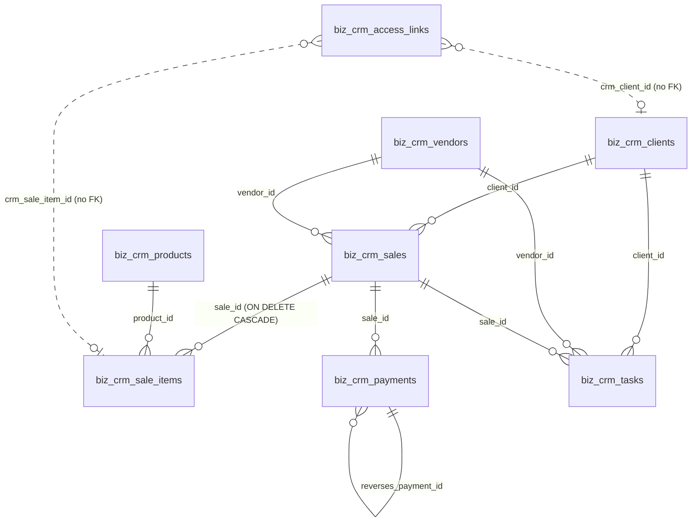

# Business CRM — Data Model

| Field | Value |
|---|---|
| **Purpose** | Document every `biz_crm_*` table: purpose, keys, relationships, ownership, sensitivity, and who reads and writes it. |
| **Scope** | The 21 tables declared in `backend/modules/business-crm/schema.sql`, plus the idempotent compatibility columns added by `db.js`. |
| **Status** | As-built, derived from the schema file. |
| **Last verified commit** | `8b76b617f67928e6454226d1861f9d35913a3981` |
| **Last verified date** | 2026-08-10 |
| **Source files inspected** | `backend/modules/business-crm/schema.sql`, `backend/modules/business-crm/db.js`, all files under `backend/modules/business-crm/routes/` and `services/`, `backend/scripts/business-crm-migrate.js`. |
| **Related documents** | [`architecture.md`](architecture.md), [`website-access-bridge.md`](website-access-bridge.md), [`api-reference.md`](api-reference.md), [`security.md`](security.md) |
| **Owner / maintainer** | Repository owner (`Toolstack7462`). |
| **What this document does not verify** | That the production database matches this schema column-for-column. Only the table count (21) and migration version (`2.0.0`) were observed in production; no column-level comparison was performed. Treat production schema drift as **PRODUCTION STATUS UNKNOWN**. |

## Conventions

All **VERIFIED FROM CODE**.

- Every table is created with `CREATE TABLE IF NOT EXISTS`. There is no `DROP`, `TRUNCATE` or
  `RENAME` anywhere in the schema, and every `ALTER` targets a `biz_crm_*` table.
  Enforced by `backend/tests/businessCrmIsolation.test.js`. **VERIFIED FROM TEST.**
- `id` columns are `CHAR(36)` UUIDs generated in Node (`crypto.randomUUID()`), not by the database.
- Money is `DECIMAL(18,2)`. It is handled in JS as integer minor units through `money.js` and is
  never parsed as a float.
- `currency_code` is `CHAR(3)`, restricted to `PKR`, `INR`, `NGN` by `money.assertCurrency`.
- Actor columns (`created_by`, `updated_by`, `ignored_by`, `user_id`, `assigned_user_id`) hold the
  **existing** admin user id as a string. They are references, not foreign keys.
- `version` columns implement optimistic concurrency; a mismatched version returns HTTP 409
  `VERSION_CONFLICT`.
- `deleted_at` means soft delete. Financial rows are never hard-deleted by the API.
- Engine `InnoDB`, charset `utf8mb4`, collation `utf8mb4_unicode_ci` on every table.

### Collation hazard

Because the tables are `utf8mb4_unicode_ci` while `mysql2` tags SQL string literals with the client
character set's default collation (`utf8mb4_general_ci`), **never compare a string-returning SQL
function to a bound parameter**. `DATE_FORMAT(col,'%Y-%m') = :month` makes both operands COERCIBLE
with different collations, and MariaDB refuses with *"Illegal mix of collations"*. Use half-open
date ranges instead. A column comparison such as `currency_code=:currency` is safe because a column
outranks a literal. This caused a production 500 and is guarded by
`backend/tests/businessCrmRuntimeDefects.test.js`. **VERIFIED FROM TEST.**

## Table inventory

21 tables. Columns/indexes counted from the schema.

| Table | PK | Cols | Idx | Purpose |
|---|---|---|---|---|
| `biz_crm_schema_migrations` | `version` | 2 | 0 | Records the applied schema version (`2.0.0`) |
| `biz_crm_settings` | `id` (always 1) | 14 | 0 | Single-row store settings: name, invoice prefix, default currency, WhatsApp country code, credential-inclusion switches |
| `biz_crm_clients` | `id` | 16 | 4 | Billing clients (CRM-owned contacts) |
| `biz_crm_vendors` | `id` | 16 | 4 | Suppliers |
| `biz_crm_products` | `id` | 16 | 4 | Pricing catalogue with default sale price and cost |
| `biz_crm_invoice_sequences` | `sequence_year` | 3 | 0 | Per-year invoice counter, incremented inside the sale transaction |
| `biz_crm_sales` | `id` | 21 | 5 | Invoice header: client, vendor, currency, totals, paid amounts, status |
| `biz_crm_sale_items` | `id` | 15 | 3 | Line items with prices, dates and encrypted optional credentials |
| `biz_crm_payments` | `id` | 16 | 4 | Client receipts and vendor payments, including reversal rows |
| `biz_crm_expenses` | `id` | 18 | 4 | Business expenses |
| `biz_crm_tasks` | `id` | 17 | 3 | Internal tasks, optionally linked to a client/vendor/sale |
| `biz_crm_activities` | `id` | 8 | 2 | Free-text activity notes against an entity |
| `biz_crm_reminders` | `id` | 11 | 3 | Prepared WhatsApp/email reminder drafts and whether they were opened |
| `biz_crm_saved_views` | `id` | 8 | 2 | Per-user saved list filters |
| `biz_crm_user_access` | `user_id` | 5 | 0 | Business role per existing admin user, plus an active flag |
| `biz_crm_user_permissions` | `user_id, permission_key` | 5 | 1 | Per-user allow/deny overrides |
| `biz_crm_audit_logs` | `id` | 12 | 3 | Redacted before/after audit trail |
| `biz_crm_sync_operations` | `idempotency_key` | 9 | 2 | Offline-queue deduplication ledger |
| `biz_crm_legacy_map` | `source_system, entity_type, legacy_id` | 5 | 1 | One-time import id mapping |
| `biz_crm_import_runs` | `id` | 9 | 2 | CSV import run results and rejected-row reasons |
| `biz_crm_access_links` | `id` | 29 | 8 | The website-access mirror — see [`website-access-bridge.md`](website-access-bridge.md) |

## Relationships

Nine declared foreign keys. **VERIFIED FROM CODE.**

`biz_crm_access_links` deliberately declares **no** foreign keys, so reconciliation and financial
history survive a referenced row disappearing. The dotted lines above are logical, not enforced.
**VERIFIED FROM CODE** (see the comment block above the table in `schema.sql`).

## Tables that matter most

### `biz_crm_sales` + `biz_crm_sale_items`

- **Source of truth:** the CRM, for money. For a **website-linked** item, operational dates come
  from `biz_crm_access_links`, which mirrors the website system — the item's own `purchase_date` and
  `expiry_date` are populated at creation but the access record remains authoritative for status.
- **Currency:** `biz_crm_sales.currency_code`. Items inherit it; a product whose currency differs is
  rejected with `PRODUCT_CURRENCY_MISMATCH`.
- **Soft delete:** `deleted_at` on the sale. `sale_items` cascade on a *hard* delete only, which the
  API never performs.
- **Sensitive:** `credential_email_ciphertext`, `credential_password_ciphertext` — AES-256-GCM,
  AAD-bound to `"<saleId>:<itemId>:email|password"`. Never returned unless the caller holds
  `credentials.view` and explicitly asks. **VERIFIED FROM CODE.**
- **Written by:** `services/salesService.js`. **Read by:** `routes/{sales,dashboard,reports,search}.js`,
  `invoicePdf.js`, `services/paymentService.js`.
- **Migration note:** `subtotal_sale` / `subtotal_cost` / `client_paid` / `vendor_paid` are
  maintained by the service, not triggers. Any new write path must maintain them or balances drift.

### `biz_crm_payments`

- **Reversal is additive.** A reversal inserts a new row referencing `reverses_payment_id`; the
  original is preserved and never updated to a deleted state. Any reporting query must account for
  reversal rows rather than assuming one row per payment. **VERIFIED FROM CODE.**
- **Overpayment guard:** `paymentService` rejects an amount exceeding the remaining balance with
  HTTP 409 `PAYMENT_EXCEEDS_BALANCE`.
- **Written by:** `services/paymentService.js`, and opening payments inside `salesService.createSale`.
- **Read by:** `routes/{payments,dashboard,reports}.js`.

### `biz_crm_user_access` / `biz_crm_user_permissions`

- These control **CRM permissions only**. They never affect login, the authentication role, or any
  non-CRM page. The CRM reads the existing `users` table but does not write it — the create-user and
  reset-password endpoints return HTTP 405 `CRM_USER_WRITE_DISABLED`. **VERIFIED FROM CODE.**
- `resolveAccess` maps the auth role to a default business role (`SUPER_ADMIN`→`OWNER`,
  `ADMIN`→`ADMIN`, anything else→`STAFF`), then applies the stored role and then the overrides.

### `biz_crm_audit_logs`

- `before_json` / `after_json` pass through `audit.clean()`, which recursively replaces any key
  matching `password|credential|cipher|token|secret|cookie` with `[REDACTED]`. **VERIFIED FROM CODE.**
- Append-only in practice; no route updates or deletes rows.

### `biz_crm_sync_operations`

- Primary key **is** the `idempotency_key`, which is what makes offline replay safe: a repeated
  batch returns the stored result instead of writing twice. **VERIFIED FROM CODE.**

## Compatibility columns added by `db.js`

`ensureCompatibilityColumns()` adds these only if absent, so it is safe to run repeatedly.
**VERIFIED FROM CODE.**

| Table | Column | Why |
|---|---|---|
| `biz_crm_products` | `category` | Added after the initial release |
| `biz_crm_settings` | `include_credentials_in_invoice`, `include_credentials_in_messages` | Credential-disclosure switches |
| `biz_crm_clients`, `biz_crm_vendors`, `biz_crm_sales` | `idempotency_key` | Duplicate-submit protection |
| `biz_crm_clients` | `website_user_id` | Nullable reference to the existing website user. A reference only — the `users` row is never written |
| `biz_crm_sale_items` | `access_source` (default `MANUAL`), `access_external_key` | Marks website-linked items; the default keeps every pre-existing row valid without a backfill |

## Safe migration rules

Follow these or a release can break production. All derived from the code and the guards in place.

1. **Additive only.** New table → `CREATE TABLE IF NOT EXISTS`. New column → add it to
   `ensureCompatibilityColumns()` with a default so existing rows stay valid.
2. **Never** `DROP`, `TRUNCATE` or `RENAME`, and never `ALTER` a non-`biz_crm_*` table. The isolation
   test fails the build if you do.
3. `ensureSchema()` runs on **every** CRM request (memoised per process), so a schema change ships
   simply by deploying the code — the first authenticated CRM request applies it. There is no
   separate migration step to forget, and equally no gate to catch a bad statement. Review schema
   edits with that in mind.
4. Bump `biz_crm_schema_migrations` only alongside a real schema change.
5. Take a database backup before any release that changes `schema.sql`. This release series did not.
6. `backend/scripts/business-crm-migrate.js` exists for running the schema explicitly; it is
   idempotent. **VERIFIED FROM CODE**, not exercised against a database here.
