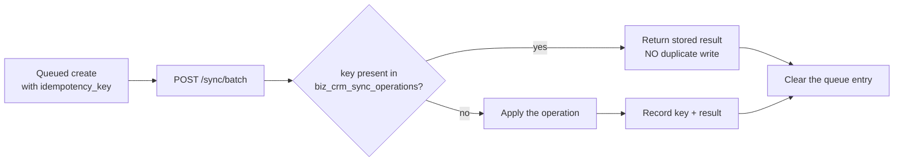

# Business CRM — Offline Queue and Service Worker

| Field | Value |
|---|---|
| **Purpose** | Document the offline queue, its idempotency guarantee, and the service-worker boundaries. |
| **Scope** | `offline/{db,queue,register}.js`, `routes/sync.js`, `biz_crm_sync_operations`, `public/admin/business/sw.js`. |
| **Status** | As-built. |
| **Last verified commit** | `8b76b617f67928e6454226d1861f9d35913a3981` |
| **Last verified date** | 2026-08-10 |
| **Source files inspected** | `frontend/src/features/business-crm/offline/db.js`, `offline/queue.js`, `offline/register.js`, `BusinessCrmContext.jsx`, `BusinessCrmLayout.jsx`, `pages/OfflineQueue.jsx`, `backend/modules/business-crm/routes/sync.js`, `backend/modules/business-crm/schema.sql`, `frontend/public/admin/business/sw.js`. |
| **Related documents** | [`security.md`](security.md), [`data-model.md`](data-model.md), [`adr/005-browser-storage-service-worker-boundaries.md`](adr/005-browser-storage-service-worker-boundaries.md) |
| **Owner / maintainer** | Repository owner (`Toolstack7462`). |
| **What this document does not verify** | A real offline→online drain against a database. The queue has **NOT VERIFIED** end-to-end behaviour with live data; the guarantees below are read from code and schema. |

## Scope of the feature

The offline queue covers **safe create operations** only. It is not a general write-behind cache, and
it does not attempt to reconcile edits, deletes or reversals made while offline.
**VERIFIED FROM CODE.**

## The idempotency guarantee

This is the property that makes replay safe, and it must not be weakened.

`biz_crm_sync_operations` uses `idempotency_key` as its **primary key**. `POST /sync/batch` looks the
key up first: if the operation is already recorded, the stored `result_json` is returned and **no
second write happens**. Otherwise the operation is applied and then recorded.
**VERIFIED FROM CODE.**

Never clear `biz_crm_sync_operations` to "reset" a stuck queue. Doing so removes the only thing
preventing a duplicate financial write on the next replay.

The same idea appears on the individual create paths too: `biz_crm_clients`, `biz_crm_vendors`,
`biz_crm_sales`, `biz_crm_payments` and `biz_crm_expenses` all carry a unique `idempotency_key`, so a
double-submitted form returns the existing record rather than creating a second one. A key belonging
to a different user is rejected with HTTP 409. **VERIFIED FROM CODE.**

## Client side

| File | Responsibility |
|---|---|
| `offline/db.js` | IndexedDB wrapper — database `genz-business-crm-v2`; holds the queue and small display caches |
| `offline/queue.js` | Enqueue, count, and `syncQueue()` drain |
| `offline/register.js` | Registers the service worker — **production builds only**, and only if `serviceWorker` is available |
| `BusinessCrmContext.jsx` | Tracks `online`, `queued`, `syncing`; drains on the browser `online` event; exposes `runSync()` |
| `BusinessCrmLayout.jsx` | Connection pill showing `Online` / `Offline` plus `N pending syncs`; clicking it opens the queue page |
| `pages/OfflineQueue.jsx` | Lists queued and recent operations and their results |

The pill is also the entry point to the Offline Queue page, since that route was removed from the
permanent sidebar. **VERIFIED FROM CODE.**

## Server side

| Endpoint | Permission | Behaviour |
|---|---|---|
| `POST /sync/batch` | `offline.sync` | Applies a batch, deduplicated by `idempotency_key` |
| `GET /sync/status` | `offline.sync` | Last 100 operations for the calling user, with parsed results |

`offline.sync` is held by OWNER, ADMIN, MANAGER and STAFF, but **not** VIEWER — a read-only role has
nothing to queue. **VERIFIED FROM CODE.**

## Service worker boundaries

`frontend/public/admin/business/sw.js`, cache `genz-business-crm-shell-v2`. All
**VERIFIED FROM CODE**, and the scope and cache contents were **VERIFIED IN PRODUCTION**.

| Property | Value |
|---|---|
| Scope | `/admin/business/` only — registered with an explicit `{ scope }` |
| Strategy | **Network-first.** Always `fetch()`; falls back to cache only in `.catch()` |
| `/api/*` | **Never cached** — the fetch handler returns early for any `/api/` pathname |
| Cross-origin | Skipped — only same-origin requests are considered |
| Non-GET | Skipped |
| What is cached | `script`, `style`, `image`, `font` responses, plus 4 precached shell paths |
| Activation | `skipWaiting()` + `clients.claim()`; on activate every cache except the current one is deleted |
| Registration | Production builds only, so local development is never affected |

Two consequences worth stating plainly:

- **A stale CRM bundle cannot be served while online**, because the strategy is network-first and
  asset filenames are content-hashed. The observed Cache Storage contained the shell paths and
  **no `/api/` entries**.
- **No financial data is cached.** Invoices, reports, payments, exports and credentials all travel
  over `/api/`, which the worker ignores entirely, and every CRM response also carries
  `Cache-Control: private, no-store`.

## Things that must stay true

1. Scope stays `/admin/business/` — it must never widen to `/admin/` or `/`.
2. `/api/` is never cached.
3. Network-first is never changed to cache-first for HTML or assets.
4. `biz_crm_sync_operations` keeps `idempotency_key` as its primary key.
5. Retries stay finite and idempotent; the queue must not spin.
6. The Offline Queue route keeps existing even though it is not in the sidebar.

## Not verified

- A real offline→online drain against a database.
- Behaviour with a large queue, or with a permanently failing operation.
- Conflict handling if the same record is edited server-side between enqueue and drain.

If you work on this area, add a test that replays the same batch twice and asserts exactly one write.
