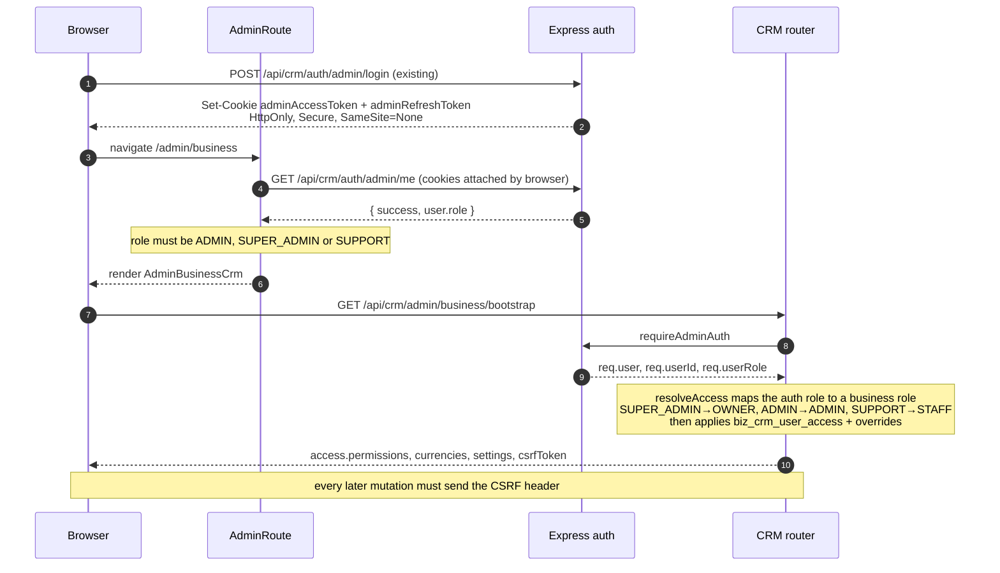
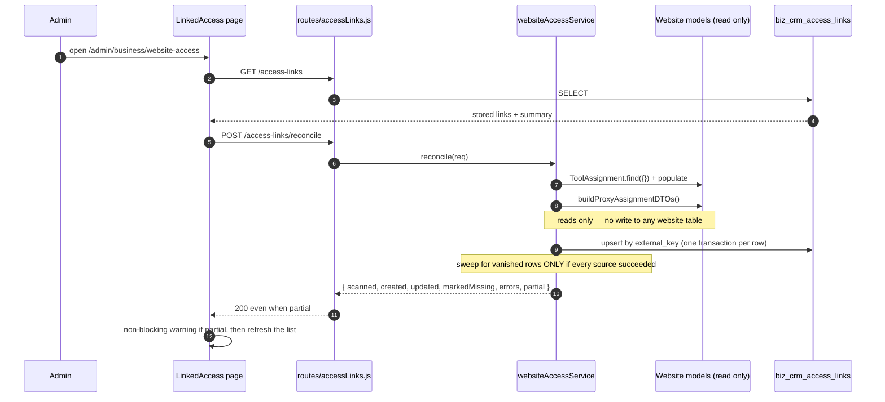
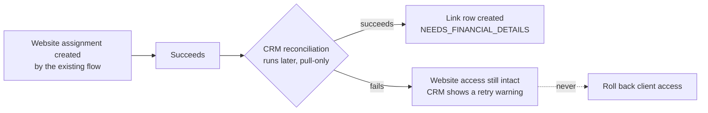
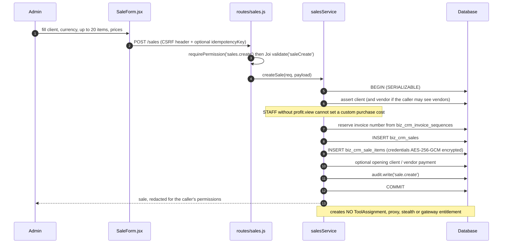
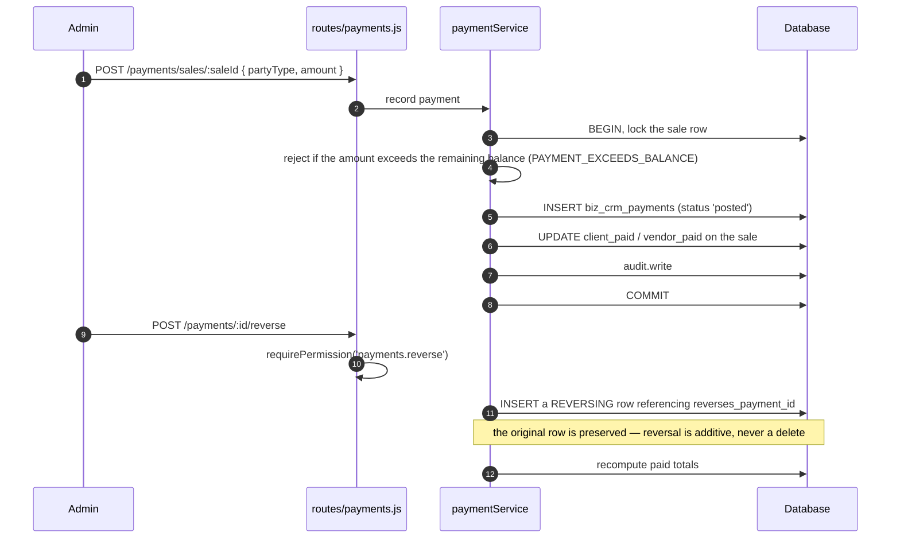
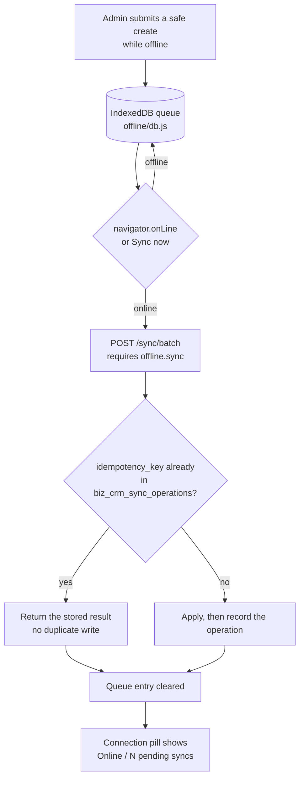
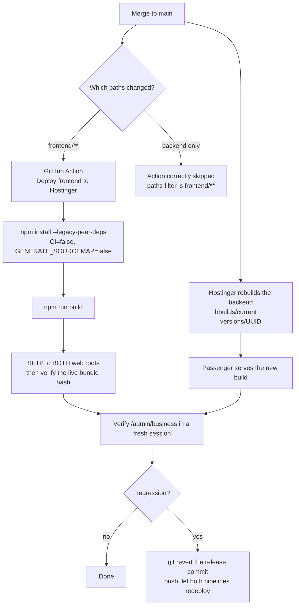

# Business CRM — System Diagrams

| Field | Value |
|---|---|
| **Purpose** | Show the CRM's structure and flows as diagrams. |
| **Scope** | System context, auth flow, reconciliation, manual sale, payment, offline queue, deployment. |
| **Status** | As-built. |
| **Last verified commit** | `8b76b617f67928e6454226d1861f9d35913a3981` |
| **Last verified date** | 2026-08-10 |
| **Source files inspected** | `backend/modules/business-crm/index.js`, `routes/{dashboard,sales,payments,accessLinks,sync}.js`, `services/{salesService,paymentService,websiteAccessService}.js`, `frontend/src/features/business-crm/{BusinessCrmApp.jsx,BusinessCrmContext.jsx,offline/queue.js}`, `frontend/src/components/AdminRoute.js`, `backend/middleware/authEnhanced.js`, `.github/workflows/deploy-frontend.yml`. |
| **Related documents** | [`architecture.md`](architecture.md), [`website-access-bridge.md`](website-access-bridge.md), [`offline-sync.md`](offline-sync.md), [`operations-runbook.md`](operations-runbook.md) |
| **Owner / maintainer** | Repository owner (`Toolstack7462`). |
| **What this document does not verify** | Runtime timing, retry counts under load, or hosting internals. The deployment diagram reflects observed behaviour on 2026-08-10, not a documented vendor contract. |

All diagrams are **VERIFIED FROM CODE** except the deployment diagram, which is
**VERIFIED IN PRODUCTION** by observation.

## System context

```mermaid
flowchart TB
  subgraph Browser
    Admin["Admin user"]
    SW["Service worker<br/>scope /admin/business/"]
    IDB[("IndexedDB<br/>offline queue")]
  end

  subgraph App["React app (app.genzdigitalstore.com)"]
    Login["/admin/login<br/>existing, unchanged"]
    Shell["AdminLayoutEnhanced<br/>existing shell"]
    CRM["/admin/business/*<br/>BusinessCrmApp"]
    Other["Other admin pages<br/>tools, members, assignments"]
  end

  subgraph API["Express (api.genzdigitalstore.com)"]
    Auth["requireAdminAuth<br/>existing middleware"]
    CRMAPI["/api/crm/admin/business/*"]
    WebAPI["Existing APIs<br/>assignments, proxy, stealth"]
  end

  subgraph DB[("MySQL / MariaDB")]
    Biz[("biz_crm_* — 21 tables<br/>CRM owns")]
    Core[("users, tools,<br/>tool_assignments — CRM reads only")]
  end

  Admin --> Login --> Shell
  Shell --> CRM
  Shell --> Other
  CRM -.registers.-> SW
  CRM -.queues creates.-> IDB
  CRM --> Auth --> CRMAPI --> Biz
  CRMAPI -. "read only" .-> Core
  Other --> Auth --> WebAPI --> Core
```

## Admin authentication flow

The CRM adds nothing to this. It reuses it end to end.



## Website access → CRM reconciliation (pull-only)



Failure isolation, drawn explicitly:



## Manual sale flow



## Client / vendor payment and reversal



## Offline queue



## Deployment

Observed on 2026-08-10. **VERIFIED IN PRODUCTION**, not a vendor-documented contract.



Note the asymmetry, because it causes confusion: a backend-only commit does **not** trigger the
frontend Action, and that is correct. The backend still redeploys through Hostinger's own build.
Never infer "nothing deployed" from an absent Action run — verify the running code instead. See
[`operations-runbook.md`](operations-runbook.md).
